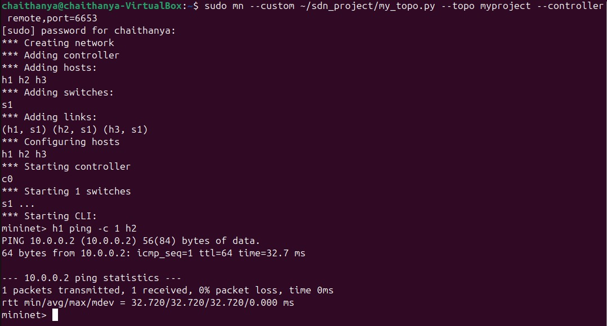
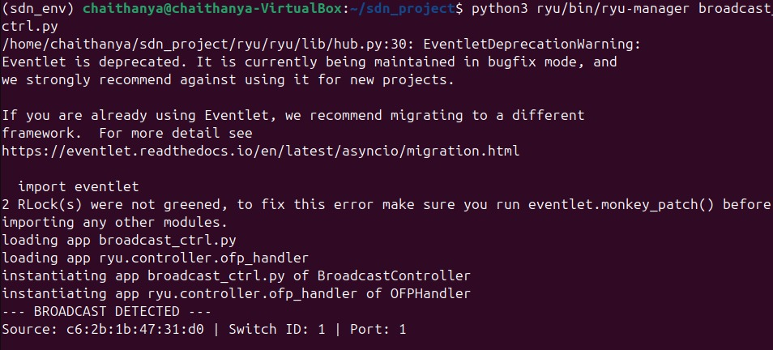
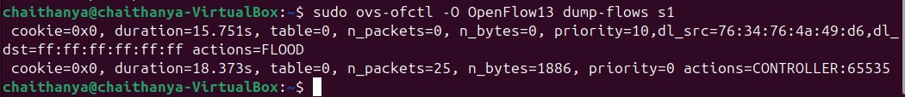
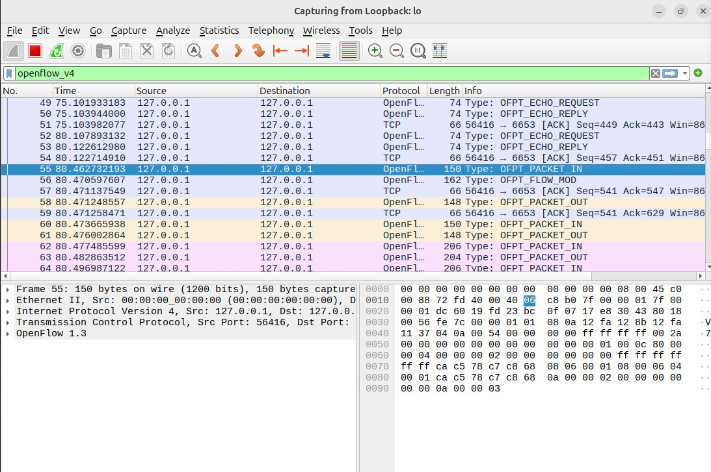

# SDN Broadcast Traffic Control System

##  Problem Statement
### 📝 Problem Statement
Traditional network infrastructures are vulnerable to "Broadcast Storms" where redundant broadcast packets (such as ARP requests) consume excessive bandwidth and Controller CPU resources. This project implements an SDN solution to:
1. **Detect** broadcast packets at the controller.
2. **Limit** flooding by offloading traffic to the Data Plane.
3. **Install** selective forwarding rules for efficient traffic management.
   
##  Technical Specifications
- **Controller:** Ryu SDN Framework (Python-based)
- **Southbound Protocol:** OpenFlow v1.3
- **Network Emulator:** Mininet
- **Switch Data Plane:** Open vSwitch (OVS)
- **Topology:** Custom Star Topology (1 Switch, 3 Hosts)

##  Setup and Execution steps
1. **Prerequisites:** Ubuntu 24.04, Mininet, Ryu.
2. **Environment:** Python 3.12 Virtual Environment.
3. **Execution:**
   - Run Controller: `python3 ryu/bin/ryu-manager broadcast_ctrl.py`
   - Run Topology: `sudo mn --custom my_topo.py --topo myproject --controller remote`

## Expected Output
**Controller Terminal:** Displays --- BROADCAST DETECTED --- upon the first ARP request.
**Mininet Terminal:** h1 ping h2 shows 0% packet loss.
**Flow Table:** A new entry with priority=10 and eth_dst=ff:ff:ff:ff:ff:ff appears after detection.

##  Evaluation & Results
- **Detection:** Controller successfully identifies ARP broadcast packets by parsing Ethernet headers.
- **Flooding Control:** Selective forwarding rules are pushed to the switch after the first discovery using the `OFPFlowMod` message.
- **Performance Improvement:** Offloading broadcast handling to the switch hardware reduces `Packet_In` events, decreasing controller CPU utilization and network latency.

##  Proof of Execution

### 1. Functional Correctness (Ping Results)

*Proves that hosts can communicate successfully through the SDN switch.*

### 2. Broadcast Detection (Controller Logs)

*Shows the Ryu controller identifying the ff:ff:ff:ff:ff:ff address in real-time.*

### 3. Selective Forwarding (Flow Tables)

*Shows the Priority 10 rule installed to limit flooding to the controller.*

### 4. Protocol Analysis (Wireshark Capture)

*Evidence of the OpenFlow 1.3 Packet_In and Flow_Mod handshake.*

## 📚 References
1. Ryu SDN Framework: https://ryu.readthedocs.io/
2. Mininet Network Emulator: http://mininet.org/
3. OpenFlow Switch Specification v1.3.0: https://opennetworking.org/
